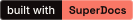

# Badge snippets



The badge lives at `https://nsumit28.github.io/built-with-superdocs/badge.svg`.
It's 133 × 20 px and about 7 KB, and it links to the gallery so anyone who
clicks it can see the list.

Use it if your project uses SuperDocs.

## Markdown

```markdown
[](https://nsumit28.github.io/built-with-superdocs/)
```

Works in GitHub and GitLab READMEs and in most static site generators.

## HTML

```html
<a href="https://nsumit28.github.io/built-with-superdocs/">
  
</a>
```

Keep the `width` and `height` attributes. They stop the page shifting around
while the image loads.

## reStructuredText

```rst
.. image:: https://nsumit28.github.io/built-with-superdocs/badge.svg
   :alt: built with SuperDocs
   :target: https://nsumit28.github.io/built-with-superdocs/
```

For PyPI long descriptions, Sphinx and Read the Docs. PyPI serves images through
its own proxy and handles SVG badges fine.

## Notes

**Leave the alt text as "built with SuperDocs".** Screen readers read it out, and
it's what shows if the image doesn't load.

**The badge is one file with no dependencies.** The text is vector outlines
rather than live text, so it renders identically everywhere. GitHub serves README
images through a proxy that blocks web fonts, and Space Grotesk — the typeface
SuperDocs uses — isn't installed on most machines, so live text would fall back
to Arial.

**Colours** are taken from superdocs.app: coral `#f97766`, near-black `#110b0b`,
cream `#fbfaf6`. Contrast is 18.7:1 on the left half and 7.3:1 on the right, both
above WCAG AA. A thin light border keeps the dark half visible on GitHub's dark
theme, where the page background is nearly the same colour.

## Rebuilding the badge

```bash
pip install fonttools brotli uharfbuzz
python3 make_badge.py       # writes badge.svg
python3 verify_badge.py     # checks it against what GitHub's proxy allows
python3 test_verify.py      # tests for verify_badge.py
```

`make_badge.py` downloads Space Grotesk and Inter, checks them against a pinned
SHA-256, and converts the text to outlines. Both fonts are SIL OFL 1.1, which
permits this.

`verify_badge.py` checks for the things GitHub's image proxy rejects or ignores:
scripts, external references, web fonts, and missing width or height.

`camo_sim.py` serves the badge locally with the same headers the proxy sends, so
you can test a change before pushing it.

## Hosting it somewhere else

Every URL here points at one base address. To serve the badge yourself, host
`badge.svg` and `index.html`, then update these snippets to match.
